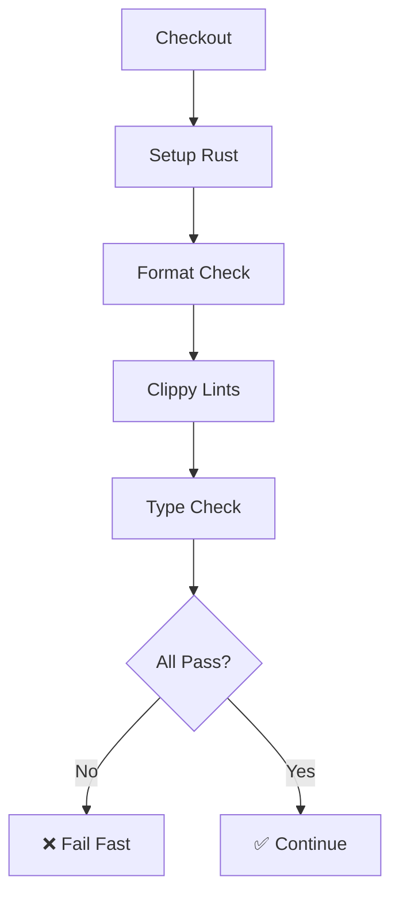

# 🚀 CI/CD Pipeline Policy & Configuration

This document outlines the comprehensive CI/CD pipeline enforced for the Wiserone project. Our pipeline implements **zero-tolerance policies** for code quality, security, and test coverage.

## 📋 Overview

The CI pipeline consists of multiple workflow files designed to enforce strict quality gates:

- **`ci.yml`**: Main CI pipeline with comprehensive checks
- **`nightly.yml`**: Extended testing and maintenance jobs
- **Branch Protection**: Enforced via GitHub settings

## 🎯 Zero-Tolerance Policies

### 1. Zero-Warning Policy
- **Enforcement**: `RUSTFLAGS="-Dwarnings"` globally set
- **Scope**: All compiler warnings treated as errors
- **Tools**: Rustc, Clippy, Rustdoc
- **No Bypassing**: No `#[allow()]` attributes without justification

### 2. Code Formatting Policy
- **Tool**: `rustfmt` with project-specific configuration
- **Enforcement**: `cargo fmt --check` must pass
- **Failure Action**: CI blocks merge until fixed
- **Configuration**: See `rustfmt.toml` for formatting rules

### 3. Test Coverage Policy
- **Requirement**: 100% test coverage
- **Tool**: `cargo-tarpaulin`
- **Enforcement**: `--fail-under 100` flag
- **No Exceptions**: All code paths must be tested

### 4. Security Policy
- **Vulnerability Scanning**: `cargo audit` must pass
- **License Compliance**: `cargo deny` checks licenses and bans
- **No Bypassing**: Security steps must NOT use `|| true`
- **Dependencies**: Regular automated updates via nightly jobs

## 🔧 CI Pipeline Architecture

### Pre-flight Checks (Fast Feedback)


**Timeout**: 10 minutes
**Fail Fast**: Any failure blocks subsequent jobs

### Test Matrix (Cross-Platform)
- **Platforms**: Ubuntu Latest, macOS Latest
- **Toolchains**: Stable, Nightly
- **Timeout**: 10 minutes per job
- **Strategy**: `fail-fast: true`

| Platform | Toolchain | Coverage | Purpose |
|----------|-----------|----------|---------|
| Ubuntu | Stable | Yes | Primary coverage analysis |
| Ubuntu | Nightly | No | Future compatibility |
| macOS | Stable | No | Platform compatibility |
| macOS | Nightly | No | Future + platform compatibility |

### Security Gates
- **Vulnerability Audit**: `cargo audit`
- **License Compliance**: `cargo deny check`
- **No Overrides**: Security failures cannot be bypassed

### Quality Gates
- **Documentation**: Generate docs with `RUSTDOCFLAGS="-Dwarnings"`
- **Doc Tests**: All examples in documentation must pass
- **Benchmarks**: Performance regression detection

## 🌙 Nightly Jobs

### Automated Maintenance
- **Schedule**: Daily at 2 AM UTC
- **Dependency Updates**: Check and report outdated dependencies
- **Issue Creation**: Automatic GitHub issues for maintenance
- **Extended Testing**: Long-running and stress tests

### Nightly Compiler Testing
- **Purpose**: Early warning for future Rust versions
- **Allow Failure**: `continue-on-error: true` for experimental features
- **Enhanced Lints**: Additional clippy rules with nightly

## 🛡️ Branch Protection

### Required Status Checks
The following CI jobs must pass before merge:

1. **🔍 Pre-flight Checks**
2. **🧪 Test Suite** (All 4 matrix combinations)
3. **🔒 Security Audit**
4. **📚 Documentation & Examples**
5. **📊 Performance Benchmarks**
6. **🎯 CI Gate** (Overall status)

### Protection Rules
- **Required Reviews**: 1 approving review
- **Dismiss Stale Reviews**: Yes
- **Require Up-to-date Branches**: Yes
- **Force Push**: Blocked
- **Delete Branch**: Blocked
- **Admin Override**: Disabled

## 🚀 Local Development

### Quick Commands
```bash
# Install tools
make install-tools

# Run all CI checks locally
make ci-local

# Quick pre-commit checks
make quick-check

# Individual checks
make fmt-check lint test coverage security docs bench
```

### Development Workflow
1. **Before Coding**: Run `make dev-setup`
2. **During Development**: Use `make quick-check`
3. **Before Commit**: Run `make ci-local`
4. **Before PR**: Ensure all checks pass

## 📊 Performance Requirements

### Build Times
- **Pre-flight Checks**: < 10 minutes
- **Test Matrix**: < 10 minutes per job
- **Total CI Time**: < 25 minutes (parallel execution)

### Optimization Strategies
- **Dependency Caching**: `Swatinem/rust-cache@v2`
- **Fail Fast**: Early termination on first failure
- **Parallel Execution**: Matrix jobs run simultaneously
- **Selective Runs**: Coverage only on stable/ubuntu

## 🔍 Troubleshooting

### Common Issues

#### "Formatting check failed"
```bash
# Fix locally
make fmt

# Verify
make fmt-check
```

#### "Clippy lints failed"
```bash
# See specific issues
cargo clippy --workspace --all-targets --all-features --no-deps -- -D warnings

# Fix and verify
make lint
```

#### "Coverage below 100%"
```bash
# Generate detailed report
make coverage

# Open coverage/tarpaulin-report.html to see uncovered lines
```

#### "Security audit failed"
```bash
# Check vulnerabilities
cargo audit

# Check licenses
cargo deny check

# See .github/deny.toml for configuration
```

### CI Debugging

#### Check Status
- Visit GitHub Actions tab in repository
- Look for red X marks indicating failures
- Click on failed job for detailed logs

#### Local Reproduction
```bash
# Reproduce CI environment
make clean
make ci-local

# Test specific matrix
rustup install nightly
cargo +nightly test
```

## 🔧 Configuration Files

### Key Configuration
- **`Cargo.toml`**: Project metadata and dependencies
- **`rustfmt.toml`**: Formatting rules (72 char width, etc.)
- **`deny.toml`**: License and security policies
- **`.github/workflows/ci.yml`**: Main CI pipeline
- **`.github/workflows/nightly.yml`**: Extended testing
- **`Makefile`**: Local development commands

### Customization
To modify CI behavior:

1. **Timeouts**: Adjust `timeout-minutes` in workflow files
2. **Matrix**: Modify `strategy.matrix` for different platforms/versions
3. **Coverage Threshold**: Change `--fail-under` value in Makefile and CI
4. **Security Policies**: Update `deny.toml` for license/vulnerability rules

## 📈 Metrics & Monitoring

### CI Health Metrics
- **Success Rate**: Target > 95%
- **Average Duration**: Target < 20 minutes
- **Flaky Test Rate**: Target < 1%

### Quality Metrics
- **Test Coverage**: Enforced at 100%
- **Security Vulnerabilities**: Zero tolerance
- **Code Quality**: Zero warnings policy

### Performance Tracking
- **Build Times**: Monitored via nightly jobs
- **Binary Size**: Tracked for regressions
- **Benchmark Results**: Historical comparison

## 🎯 Enforcement Strategy

### Developer Experience
- **Fast Feedback**: Pre-flight checks complete in < 10 minutes
- **Clear Errors**: Detailed failure messages with fix suggestions
- **Local Testing**: `make ci-local` mirrors CI exactly

### Quality Assurance
- **No Compromises**: Zero-warning and 100% coverage policies
- **Automated Updates**: Nightly dependency maintenance
- **Security First**: All security checks must pass

### Continuous Improvement
- **Regular Reviews**: Monthly CI policy reviews
- **Tool Updates**: Automated dependency updates
- **Performance Optimization**: Ongoing build time improvements

---

## ⚡ Quick Reference

| Command | Purpose | Timeout |
|---------|---------|---------|
| `make fmt-check` | Verify formatting | 2 min |
| `make lint` | Clippy with zero warnings | 5 min |
| `make test` | Full test suite | 10 min |
| `make coverage` | 100% coverage check | 15 min |
| `make security` | Security audits | 5 min |
| `make ci-local` | Full CI simulation | 25 min |

**Remember**: The CI pipeline is designed to maintain the highest quality standards. Every check serves a purpose in ensuring a reliable, secure, and maintainable codebase.